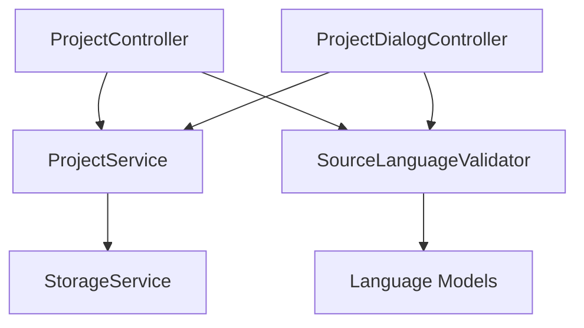

# 修复源语言设计问题 - Design Document

## Overview

本功能旨在修复当前翻译管理系统中源语言可修改的设计缺陷，通过实施固定主语言方案来提高系统的稳定性和数据一致性。主要修改包括：将项目的defaultLanguage改为不可修改的primaryLanguage，移除所有源语言编辑功能，确保数据一致性验证。

## Steering Document Alignment

### Technical Standards (tech.md)
- **Flutter框架选择**：继续使用Flutter Web作为前端框架，确保跨平台一致性
- **GetX状态管理**：使用GetX进行状态管理，保持轻量级响应式架构
- **包化架构**：修改core包中的数据模型和业务逻辑，保持包的独立性和可重用性
- **文件系统存储**：保持本地文件系统作为主要存储方式，不引入外部依赖

### Project Structure (structure.md)
- **分层架构**：修改core层的models和services，保持MVC架构分层
- **模块化设计**：每个feature模块保持独立，通过bindings进行依赖注入
- **命名规范**：保持camelCase和PascalCase的现有命名约定
- **导入模式**：继续使用package:导入方式，避免相对路径导入

## Code Reuse Analysis

### Existing Components to Leverage
- **Project Model**: 扩展现有的Project类，修改defaultLanguage为primaryLanguage
- **TranslationEntry Model**: 保持现有结构，sourceLanguage字段继续使用
- **ProjectController**: 移除源语言编辑相关方法，添加数据一致性验证
- **ProjectDialogController**: 修改创建和编辑逻辑，移除源语言选择功能

### Integration Points
- **存储服务**: 现有的文件系统存储不需要修改，数据格式保持兼容
- **翻译服务**: TranslationService接口保持不变，内部实现添加一致性验证
- **UI组件**: 现有的项目设置和语言设置页面需要修改，移除源语言编辑控件

## Architecture

采用渐进式重构策略，保持现有系统的稳定性和向后兼容性。主要修改集中在数据模型和业务逻辑层，UI层做最小化调整。

### Modular Design Principles
- **Single File Responsibility**: 每个文件只负责一个具体的功能领域
- **Component Isolation**: 将源语言验证逻辑提取为独立的工具类
- **Service Layer Separation**: 保持数据访问、业务逻辑和表现层的清晰分离
- **Utility Modularity**: 创建专门的数据一致性验证工具



## Components and Interfaces

### SourceLanguageValidator (新增)
- **Purpose**: 验证和修复源语言数据一致性
- **Interfaces**: 
  - `validateProjectSourceLanguage(Project project)`
  - `fixInconsistentSourceLanguages(Project project)`
  - `isSourceLanguageConsistent(TranslationEntry entry, Language primaryLanguage)`
- **Dependencies**: Project, TranslationEntry, Language models
- **Reuses**: 现有的语言验证逻辑

### Project Model (修改)
- **Purpose**: 项目核心数据模型，固定主语言
- **Interfaces**: 现有的copyWith, toJson, fromJson方法
- **Dependencies**: Language model
- **Reuses**: 现有的数据序列化逻辑

### ProjectService (修改)
- **Purpose**: 项目管理业务逻辑
- **Interfaces**: 现有的CRUD操作接口
- **Dependencies**: SourceLanguageValidator
- **Reuses**: 现有的项目管理逻辑

## Data Models

### Project (修改后)
```dart
class Project extends Equatable {
  const Project({
    required this.id,
    required this.name,
    required this.description,
    required this.primaryLanguage,  // 修改：从defaultLanguage改为primaryLanguage
    required this.targetLanguages,
    required this.owner,
    required this.createdAt,
    required this.updatedAt,
    this.isActive = true,
    this.lastAccessedAt,
    this.settings,
  });

  final String id;
  final String name;
  final String description;
  final Language primaryLanguage;  // 固定不变的主语言
  final List<Language> targetLanguages;
  final User owner;
  final DateTime createdAt;
  final DateTime updatedAt;
  final bool isActive;
  final DateTime? lastAccessedAt;
  final ProjectSettings? settings;

  // 计算属性
  List<Language> get allLanguages => [primaryLanguage, ...targetLanguages];
}
```

### TranslationEntry (保持不变)
```dart
class TranslationEntry extends Equatable {
  final String id;
  final String key;
  final String projectId;
  final Language sourceLanguage;  // 继续使用，运行时验证一致性
  final Language targetLanguage;
  final String sourceText;
  final String targetText;
  final TranslationStatus status;
  final DateTime createdAt;
  final DateTime updatedAt;
  final User? translator;
  final User? reviewer;
  final String? comment;
  final String? context;
  final int? maxLength;
  final bool isPlural;
  final Map<String, String>? pluralForms;
}
```

## Error Handling

### Error Scenarios
1. **数据不一致发现**: 当加载项目时发现翻译条目的源语言与项目主语言不匹配
   - **Handling**: 记录错误日志，自动修复或标记为需要审核
   - **User Impact**: 显示警告信息，建议用户检查数据完整性

2. **源语言修改尝试**: 用户或代码尝试修改项目的主语言
   - **Handling**: 在业务逻辑层阻止操作，返回明确的错误信息
   - **User Impact**: 显示"项目主语言不可修改"的错误提示

3. **项目创建时主语言缺失**: 创建项目时未指定主语言
   - **Handling**: 在表单验证阶段阻止提交
   - **User Impact**: 显示"必须选择项目主语言"的验证错误

## Testing Strategy

### Unit Testing
- **SourceLanguageValidator**: 测试所有验证和修复方法
- **Project Model**: 测试数据一致性计算属性
- **ProjectService**: 测试CRUD操作中的验证逻辑

### Integration Testing
- **项目创建流程**: 验证主语言设置和后续不可修改性
- **翻译条目创建**: 验证源语言自动使用项目主语言
- **数据加载**: 验证数据一致性检查和自动修复

### End-to-End Testing
- **完整项目生命周期**: 从创建到使用，验证主语言固定性
- **数据迁移场景**: 验证现有项目的数据一致性处理
- **错误恢复**: 验证系统在发现不一致数据时的恢复能力