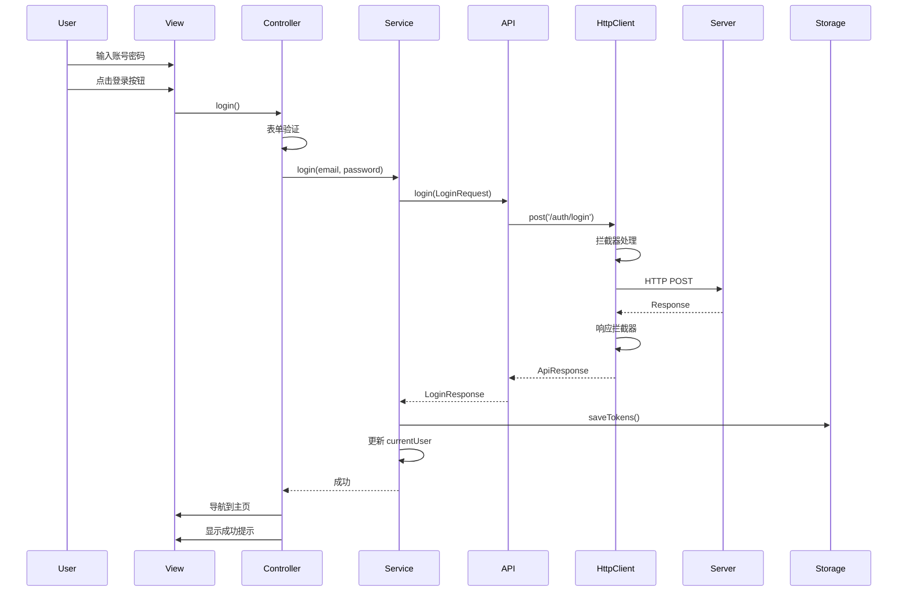
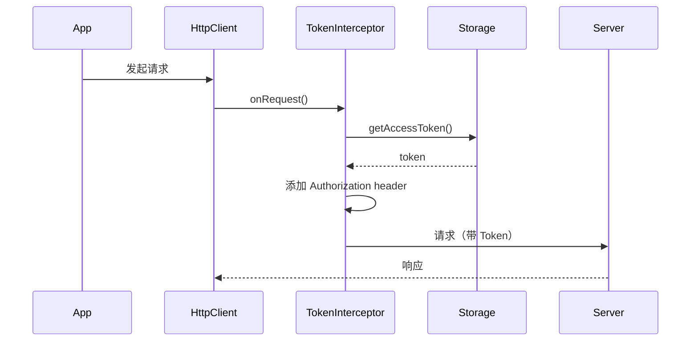

# 登录功能实现技术方案

> **项目**: TTPolyglot 翻译管理平台  
> **功能**: 用户登录认证
> **版本**: 1.0.0  
> **日期**: 2025-10-14

---

## 📑 目录

- [1. 项目概述](#1-项目概述)
- [2. 技术架构](#2-技术架构)
- [3. 目录结构](#3-目录结构)
- [4. 核心模块说明](#4-核心模块说明)
- [5. 数据流程](#5-数据流程)
- [6. API 接口设计](#6-api-接口设计)
- [7. 实现步骤](#7-实现步骤)
- [8. 技术选型](#8-技术选型)
- [9. 注意事项](#9-注意事项)

---

## 1. 项目概述

### 1.1 功能目标

实现用户登录功能，包括：
- ✅ 用户名/邮箱 + 密码登录
- ✅ Token 存储和管理
- ✅ 登录状态维护
- ✅ 自动 Token 刷新
- ✅ 统一错误处理
- ✅ 统一 Loading 状态管理
- ✅ 响应式 UI 设计

### 1.2 技术要求

- 遵循项目编码规范（使用 `dart:developer` 的 `log`）
- 使用 Freezed 生成不可变数据模型
- 使用 GetX 进行状态管理和依赖注入
- 使用 Dio 进行网络请求
- 支持多平台（Web、Desktop、Mobile）

---

## 2. 技术架构

### 2.1 分层架构

```
┌─────────────────────────────────────────┐
│         Presentation Layer              │
│    (Views + Controllers + Bindings)     │
│         features/sign_in/               │
└──────────────┬──────────────────────────┘
               │
               ↓
┌─────────────────────────────────────────┐
│          Service Layer                  │
│     (Business Logic + State)            │
│      common/services/                   │
└──────────────┬──────────────────────────┘
               │
               ↓
┌─────────────────────────────────────────┐
│           API Layer                     │
│      (HTTP Requests + Mapping)          │
│         common/api/                     │
└──────────────┬──────────────────────────┘
               │
               ↓
┌─────────────────────────────────────────┐
│        Network Layer                    │
│   (Dio Client + Interceptors)           │
│       common/network/                   │
└──────────────┬──────────────────────────┘
               │
               ↓
┌─────────────────────────────────────────┐
│         Server API                      │
│   POST /api/auth/login                  │
└─────────────────────────────────────────┘
```

### 2.2 数据流向

```
用户输入
   ↓
SignInView (UI)
   ↓
SignInController (状态管理)
   ↓
AuthService (业务逻辑)
   ↓
AuthApi (API 封装)
   ↓
HttpClient (网络请求)
   ↓
Interceptors (拦截器链)
   ↓
Server API
   ↓
Response (返回数据)
   ↓
Interceptors (响应处理)
   ↓
Model (Freezed 模型)
   ↓
TokenStorage (本地存储)
   ↓
UI 更新 + 导航
```

---

## 3. 目录结构

### 3.1 新增目录树

```
lib/src/
├── common/                          # 【新建】公共基础设施
│   ├── config/                      # 配置
│   │   ├── app_config.dart          # 应用配置类
│   │   └── config.dart              # 导出文件
│   │
│   ├── network/                     # 网络层
│   │   ├── http_client.dart         # Dio 单例客户端
│   │   ├── http_api.dart            # 泛型 API 封装
│   │   ├── base_api.dart            # CRUD 基类（可选）
│   │   ├── interceptors/            # 拦截器
│   │   │   ├── token_interceptor.dart     # Token 自动注入
│   │   │   ├── response_interceptor.dart  # 响应统一处理
│   │   │   ├── error_interceptor.dart     # 错误统一处理
│   │   │   ├── loading_interceptor.dart   # Loading 状态
│   │   │   └── log_interceptor.dart       # 日志记录
│   │   ├── models/                  # 网络层模型
│   │   │   ├── api_response.dart          # 统一响应（Freezed）
│   │   │   ├── request_extra.dart         # 请求配置
│   │   │   └── network_models.dart        # 导出
│   │   └── network.dart             # 网络层导出
│   │
│   ├── models/                      # 公共数据模型
│   │   ├── auth/                    # 认证模型
│   │   │   ├── login_request.dart         # 登录请求（Freezed）
│   │   │   ├── login_response.dart        # 登录响应（Freezed）
│   │   │   ├── user_info.dart             # 用户信息（Freezed）
│   │   │   ├── token_info.dart            # Token 信息（Freezed）
│   │   │   └── auth_models.dart           # 导出
│   │   └── models.dart              # 模型总导出
│   │
│   ├── api/                         # API 接口层
│   │   ├── auth_api.dart            # 认证 API
│   │   └── api.dart                 # API 导出
│   │
│   ├── services/                    # 公共服务
│   │   ├── auth_service.dart        # 认证服务
│   │   ├── token_storage_service.dart   # Token 存储
│   │   └── services.dart            # 服务导出
│   │
│   └── common.dart                  # common 总导出
│
└── features/sign_in/                # 【更新】登录功能
    ├── controllers/
    │   └── sign_in_controller.dart  # 登录控制器（更新）
    ├── views/
    │   └── sign_in_view.dart        # 登录视图（更新）
    ├── bindings/
    │   └── sign_in_binding.dart     # 依赖注入（更新）
    └── sign_in.dart
```

### 3.2 目录职责说明

| 目录 | 职责 | 依赖方向 |
|------|------|----------|
| `common/config/` | 应用配置（API URL、超时等） | 被 network 依赖 |
| `common/network/` | 网络层基础设施 | 被 api 依赖 |
| `common/models/` | 数据模型定义 | 被 api、services 依赖 |
| `common/api/` | API 接口封装 | 被 services 依赖 |
| `common/services/` | 业务逻辑服务 | 被 features 依赖 |
| `features/sign_in/` | 登录功能实现 | 依赖 common |

---

## 4. 核心模块说明

### 4.1 配置层 (`common/config/`)

#### AppConfig
```dart
class AppConfig {
  // API 配置
  static const String apiBaseUrl = 'http://localhost:3000/api';
  static const Duration connectTimeout = Duration(seconds: 30);
  static const Duration receiveTimeout = Duration(seconds: 30);
  
  // Token 配置
  static const String accessTokenKey = 'access_token';
  static const String refreshTokenKey = 'refresh_token';
  
  // 请求配置
  static const int requestTimeThreshold = 1000; // 最小请求时间（毫秒）
  static const int pageSize = 20; // 分页大小
}
```

**作用**: 集中管理应用配置，方便环境切换和维护。

---

### 4.2 网络层 (`common/network/`)

#### 4.2.1 HttpClient（核心）

```dart
class HttpClient {
  static final HttpClient _instance = HttpClient._();
  late final Dio _dio;
  
  factory HttpClient() => _instance;
  
  HttpClient._() {
    _dio = Dio(BaseOptions(
      baseUrl: AppConfig.apiBaseUrl,
      connectTimeout: AppConfig.connectTimeout,
      receiveTimeout: AppConfig.receiveTimeout,
      headers: {
        'Content-Type': 'application/json',
        'Accept': 'application/json',
      },
    ));
    
    // 注册拦截器（顺序很重要！）
    _dio.interceptors.add(LoadingInterceptor());
    _dio.interceptors.add(TokenInterceptor());
    _dio.interceptors.add(LogInterceptor());
    _dio.interceptors.add(ResponseInterceptor());
    _dio.interceptors.add(ErrorInterceptor());
  }
  
  static Dio get dio => _instance._dio;
  
  // 静态方法：GET/POST/PUT/DELETE
  static Future<T> get<T>(String path, {...});
  static Future<T> post<T>(String path, {...});
  static Future<T> put<T>(String path, {...});
  static Future<T> delete<T>(String path, {...});
}
```

**特点**:
- 单例模式，全局唯一 Dio 实例
- 统一配置 baseUrl、超时、headers
- 集中管理拦截器
- 提供静态方法方便调用

---

#### 4.2.2 拦截器链

**执行顺序**:
```
Request → LoadingInterceptor → TokenInterceptor → LogInterceptor → Server
Server → ResponseInterceptor → ErrorInterceptor → Result
```

**各拦截器职责**:

| 拦截器 | 职责 | 触发时机 |
|--------|------|----------|
| LoadingInterceptor | 显示/隐藏 Loading | 请求前/后 |
| TokenInterceptor | 自动注入 Token | 请求前 |
| LogInterceptor | 打印请求日志 | 请求前/响应后 |
| ResponseInterceptor | 统一响应处理 | 响应成功时 |
| ErrorInterceptor | 统一错误处理 | 请求失败时 |

---

#### 4.2.3 ApiResponse（统一响应）

```dart
@freezed
class ApiResponse<T> with _$ApiResponse<T> {
  const factory ApiResponse({
    required int code,
    required String message,
    T? data,
  }) = _ApiResponse<T>;
  
  factory ApiResponse.fromJson(
    Map<String, dynamic> json,
    T Function(Object?)? fromJsonT,
  ) => _$ApiResponseFromJson(json, fromJsonT);
}
```

**服务端响应格式**:
```json
{
  "code": 200,
  "message": "登录成功",
  "data": {
    "user": { ... },
    "tokens": { ... }
  }
}
```

---

#### 4.2.4 RequestExtra（请求配置）

```dart
class RequestExtra {
  final bool showLoading;       // 是否显示 loading
  final bool showSuccessToast;  // 是否显示成功提示
  final bool showErrorToast;    // 是否显示错误提示
  
  const RequestExtra({
    this.showLoading = false,
    this.showSuccessToast = false,
    this.showErrorToast = true,
  });
}
```

**使用示例**:
```dart
await HttpClient.post(
  '/auth/login',
  data: loginData,
  options: Options(
    extra: RequestExtra(
      showLoading: true,
      showErrorToast: true,
    ).toJson(),
  ),
);
```

---

### 4.3 模型层 (`common/models/auth/`)

#### 4.3.1 LoginRequest

```dart
@freezed
class LoginRequest with _$LoginRequest {
  const factory LoginRequest({
    @JsonKey(name: 'email_or_username') required String emailOrUsername,
    required String password,
    @JsonKey(name: 'device_id') String? deviceId,
    @JsonKey(name: 'device_name') String? deviceName,
    @JsonKey(name: 'device_type') String? deviceType,
  }) = _LoginRequest;
  
  factory LoginRequest.fromJson(Map<String, dynamic> json) =>
      _$LoginRequestFromJson(json);
}
```

---

#### 4.3.2 UserInfo

```dart
@freezed
class UserInfo with _$UserInfo {
  const factory UserInfo({
    required String id,
    required String username,
    required String email,
    @JsonKey(name: 'display_name') String? displayName,
    @JsonKey(name: 'avatar_url') String? avatarUrl,
    String? timezone,
    String? locale,
    @JsonKey(name: 'is_email_verified') bool? isEmailVerified,
  }) = _UserInfo;
  
  factory UserInfo.fromJson(Map<String, dynamic> json) =>
      _$UserInfoFromJson(json);
}
```

---

#### 4.3.3 TokenInfo

```dart
@freezed
class TokenInfo with _$TokenInfo {
  const factory TokenInfo({
    @JsonKey(name: 'access_token') required String accessToken,
    @JsonKey(name: 'refresh_token') required String refreshToken,
    @JsonKey(name: 'token_type') required String tokenType,
    @JsonKey(name: 'expires_in') required int expiresIn,
  }) = _TokenInfo;
  
  factory TokenInfo.fromJson(Map<String, dynamic> json) =>
      _$TokenInfoFromJson(json);
}
```

---

#### 4.3.4 LoginResponse

```dart
@freezed
class LoginResponse with _$LoginResponse {
  const factory LoginResponse({
    required UserInfo user,
    required TokenInfo tokens,
  }) = _LoginResponse;
  
  factory LoginResponse.fromJson(Map<String, dynamic> json) =>
      _$LoginResponseFromJson(json);
}
```

---

### 4.4 API 层 (`common/api/`)

#### AuthApi

```dart
class AuthApi {
  /// 登录
  Future<LoginResponse> login(LoginRequest request) async {
    final response = await HttpClient.post<Map<String, dynamic>>(
      '/auth/login',
      data: request.toJson(),
      options: Options(
        extra: RequestExtra(
          showLoading: true,
          showErrorToast: true,
        ).toJson(),
      ),
    );
    
    return LoginResponse.fromJson(response['data']);
  }
  
  /// 登出
  Future<void> logout() async {
    await HttpClient.post('/auth/logout');
  }
  
  /// 刷新 Token
  Future<TokenInfo> refreshToken(String refreshToken) async {
    final response = await HttpClient.post<Map<String, dynamic>>(
      '/auth/refresh',
      data: {'refresh_token': refreshToken},
    );
    
    return TokenInfo.fromJson(response['data']);
  }
  
  /// 获取当前用户
  Future<UserInfo> getCurrentUser() async {
    final response = await HttpClient.get<Map<String, dynamic>>('/auth/me');
    return UserInfo.fromJson(response['data']);
  }
}
```

---

### 4.5 服务层 (`common/services/`)

#### 4.5.1 TokenStorageService

```dart
class TokenStorageService {
  final SharedPreferences _prefs;
  
  TokenStorageService(this._prefs);
  
  /// 保存 Token
  Future<void> saveTokens({
    required String accessToken,
    required String refreshToken,
  }) async {
    await _prefs.setString(AppConfig.accessTokenKey, accessToken);
    await _prefs.setString(AppConfig.refreshTokenKey, refreshToken);
  }
  
  /// 获取 Access Token
  String? getAccessToken() {
    return _prefs.getString(AppConfig.accessTokenKey);
  }
  
  /// 获取 Refresh Token
  String? getRefreshToken() {
    return _prefs.getString(AppConfig.refreshTokenKey);
  }
  
  /// 删除 Token
  Future<void> clearTokens() async {
    await _prefs.remove(AppConfig.accessTokenKey);
    await _prefs.remove(AppConfig.refreshTokenKey);
  }
  
  /// 是否已登录
  bool get isLoggedIn => getAccessToken() != null;
}
```

---

#### 4.5.2 AuthService

```dart
class AuthService extends GetxService {
  final AuthApi _authApi;
  final TokenStorageService _tokenStorage;
  
  // 当前用户
  final Rx<UserInfo?> _currentUser = Rx<UserInfo?>(null);
  UserInfo? get currentUser => _currentUser.value;
  
  // 是否已登录
  bool get isLoggedIn => _tokenStorage.isLoggedIn;
  
  AuthService({
    required AuthApi authApi,
    required TokenStorageService tokenStorage,
  })  : _authApi = authApi,
        _tokenStorage = tokenStorage;
  
  /// 登录
  Future<void> login({
    required String emailOrUsername,
    required String password,
    String? deviceId,
    String? deviceName,
  }) async {
    try {
      final request = LoginRequest(
        emailOrUsername: emailOrUsername,
        password: password,
        deviceId: deviceId,
        deviceName: deviceName,
        deviceType: 'web',
      );
      
      final response = await _authApi.login(request);
      
      // 保存 Token
      await _tokenStorage.saveTokens(
        accessToken: response.tokens.accessToken,
        refreshToken: response.tokens.refreshToken,
      );
      
      // 保存用户信息
      _currentUser.value = response.user;
      
      log('登录成功: ${response.user.username}', name: 'AuthService');
    } catch (error, stackTrace) {
      log('登录失败', error: error, stackTrace: stackTrace, name: 'AuthService');
      rethrow;
    }
  }
  
  /// 登出
  Future<void> logout() async {
    try {
      await _authApi.logout();
    } catch (error, stackTrace) {
      log('登出请求失败', error: error, stackTrace: stackTrace, name: 'AuthService');
    } finally {
      // 无论如何都清除本地数据
      await _tokenStorage.clearTokens();
      _currentUser.value = null;
    }
  }
  
  /// 刷新 Token
  Future<void> refreshToken() async {
    try {
      final oldRefreshToken = _tokenStorage.getRefreshToken();
      if (oldRefreshToken == null) {
        throw Exception('Refresh token not found');
      }
      
      final newTokens = await _authApi.refreshToken(oldRefreshToken);
      
      await _tokenStorage.saveTokens(
        accessToken: newTokens.accessToken,
        refreshToken: newTokens.refreshToken,
      );
      
      log('Token 刷新成功', name: 'AuthService');
    } catch (error, stackTrace) {
      log('Token 刷新失败', error: error, stackTrace: stackTrace, name: 'AuthService');
      rethrow;
    }
  }
  
  /// 初始化（检查登录状态）
  Future<void> init() async {
    if (isLoggedIn) {
      try {
        _currentUser.value = await _authApi.getCurrentUser();
      } catch (error, stackTrace) {
        log('获取用户信息失败', error: error, stackTrace: stackTrace, name: 'AuthService');
        await logout();
      }
    }
  }
}
```

---

### 4.6 功能层 (`features/sign_in/`)

#### 4.6.1 SignInController

```dart
class SignInController extends GetxController {
  final AuthService _authService = Get.find<AuthService>();
  
  // 表单控制器
  final emailController = TextEditingController();
  final passwordController = TextEditingController();
  
  // 响应式状态
  final _isLoading = false.obs;
  final _errorMessage = ''.obs;
  final _showPassword = false.obs;
  
  // Getters
  bool get isLoading => _isLoading.value;
  String get errorMessage => _errorMessage.value;
  bool get showPassword => _showPassword.value;
  
  /// 切换密码显示
  void togglePasswordVisibility() {
    _showPassword.value = !_showPassword.value;
  }
  
  /// 表单验证
  String? validateEmail(String? value) {
    if (value == null || value.isEmpty) {
      return '请输入用户名或邮箱';
    }
    return null;
  }
  
  String? validatePassword(String? value) {
    if (value == null || value.isEmpty) {
      return '请输入密码';
    }
    if (value.length < 6) {
      return '密码至少6位';
    }
    return null;
  }
  
  /// 登录
  Future<void> login() async {
    // 清除之前的错误
    _errorMessage.value = '';
    
    // 验证表单
    final emailError = validateEmail(emailController.text);
    final passwordError = validatePassword(passwordController.text);
    
    if (emailError != null) {
      _errorMessage.value = emailError;
      return;
    }
    
    if (passwordError != null) {
      _errorMessage.value = passwordError;
      return;
    }
    
    try {
      _isLoading.value = true;
      
      await _authService.login(
        emailOrUsername: emailController.text.trim(),
        password: passwordController.text,
        deviceName: 'Web Browser',
      );
      
      // 登录成功，导航到主页
      Get.offAllNamed('/projects');
      
      // 显示成功提示
      Get.snackbar(
        '成功',
        '登录成功',
        snackPosition: SnackPosition.TOP,
        backgroundColor: Colors.green.withValues(alpha: 0.9),
        colorText: Colors.white,
        duration: const Duration(seconds: 2),
      );
    } catch (error, stackTrace) {
      log('登录失败', error: error, stackTrace: stackTrace, name: 'SignInController');
      _errorMessage.value = error.toString();
    } finally {
      _isLoading.value = false;
    }
  }
  
  @override
  void onClose() {
    emailController.dispose();
    passwordController.dispose();
    super.onClose();
  }
}
```

---

#### 4.6.2 SignInView

```dart
class SignInView extends GetView<SignInController> {
  const SignInView({super.key});
  
  @override
  Widget build(BuildContext context) {
    return Scaffold(
      body: Center(
        child: SingleChildScrollView(
          child: Container(
            constraints: const BoxConstraints(maxWidth: 400.0),
            padding: const EdgeInsets.all(24.0),
            child: Column(
              mainAxisAlignment: MainAxisAlignment.center,
              crossAxisAlignment: CrossAxisAlignment.stretch,
              children: [
                // Logo
                Icon(
                  Icons.translate,
                  size: 64.0,
                  color: Theme.of(context).primaryColor,
                ),
                const SizedBox(height: 16.0),
                
                // 标题
                Text(
                  'TTPolyglot',
                  style: Theme.of(context).textTheme.headlineMedium,
                  textAlign: TextAlign.center,
                ),
                const SizedBox(height: 8.0),
                
                Text(
                  '翻译管理平台',
                  style: Theme.of(context).textTheme.bodyMedium,
                  textAlign: TextAlign.center,
                ),
                const SizedBox(height: 48.0),
                
                // 用户名/邮箱输入框
                TextField(
                  controller: controller.emailController,
                  decoration: InputDecoration(
                    labelText: '用户名或邮箱',
                    prefixIcon: const Icon(Icons.person),
                    border: OutlineRadius(
                      borderRadius: BorderRadius.circular(8.0),
                    ),
                  ),
                  keyboardType: TextInputType.emailAddress,
                ),
                const SizedBox(height: 16.0),
                
                // 密码输入框
                Obx(() => TextField(
                  controller: controller.passwordController,
                  obscureText: !controller.showPassword,
                  decoration: InputDecoration(
                    labelText: '密码',
                    prefixIcon: const Icon(Icons.lock),
                    suffixIcon: IconButton(
                      icon: Icon(
                        controller.showPassword
                            ? Icons.visibility_off
                            : Icons.visibility,
                      ),
                      onPressed: controller.togglePasswordVisibility,
                    ),
                    border: OutlineInputBorder(
                      borderRadius: BorderRadius.circular(8.0),
                    ),
                  ),
                  onSubmitted: (_) => controller.login(),
                )),
                const SizedBox(height: 8.0),
                
                // 错误提示
                Obx(() => controller.errorMessage.isNotEmpty
                    ? Padding(
                        padding: const EdgeInsets.only(bottom: 8.0),
                        child: Text(
                          controller.errorMessage,
                          style: TextStyle(
                            color: Theme.of(context).colorScheme.error,
                            fontSize: 14.0,
                          ),
                        ),
                      )
                    : const SizedBox.shrink()),
                const SizedBox(height: 16.0),
                
                // 登录按钮
                Obx(() => ElevatedButton(
                  onPressed: controller.isLoading ? null : controller.login,
                  style: ElevatedButton.styleFrom(
                    padding: const EdgeInsets.symmetric(vertical: 16.0),
                    shape: RoundedRectangleBorder(
                      borderRadius: BorderRadius.circular(8.0),
                    ),
                  ),
                  child: controller.isLoading
                      ? const SizedBox(
                          height: 20.0,
                          width: 20.0,
                          child: CircularProgressIndicator(
                            strokeWidth: 2.0,
                          ),
                        )
                      : const Text(
                          '登录',
                          style: TextStyle(fontSize: 16.0),
                        ),
                )),
              ],
            ),
          ),
        ),
      ),
    );
  }
}
```

---

#### 4.6.3 SignInBinding

```dart
class SignInBinding extends Bindings {
  @override
  void dependencies() async {
    // 初始化 SharedPreferences
    final prefs = await SharedPreferences.getInstance();
    
    // 注册 TokenStorageService
    Get.lazyPut<TokenStorageService>(
      () => TokenStorageService(prefs),
      fenix: true,
    );
    
    // 注册 AuthApi
    Get.lazyPut<AuthApi>(
      () => AuthApi(),
      fenix: true,
    );
    
    // 注册 AuthService
    Get.lazyPut<AuthService>(
      () => AuthService(
        authApi: Get.find<AuthApi>(),
        tokenStorage: Get.find<TokenStorageService>(),
      ),
      fenix: true,
    );
    
    // 注册 SignInController
    Get.lazyPut<SignInController>(
      () => SignInController(),
      fenix: true,
    );
  }
}
```

---

## 5. 数据流程

### 5.1 登录流程



### 5.2 Token 注入流程



---

## 6. API 接口设计

### 6.1 登录接口

**请求**:
```http
POST /api/auth/login
Content-Type: application/json

{
  "email_or_username": "admin",
  "password": "123456",
  "device_id": "web-browser-uuid",
  "device_name": "Chrome Browser",
  "device_type": "web"
}
```

**响应（成功）**:
```json
{
  "code": 200,
  "message": "登录成功",
  "data": {
    "tokens": {
      "access_token": "eyJhbGciOiJIUzI1NiIs...",
      "refresh_token": "eyJhbGciOiJIUzI1NiIs...",
      "token_type": "Bearer",
      "expires_in": 86400
    }
  }
}
```

**响应（失败）**:
```json
{
  "code": 401,
  "message": "用户名或密码错误",
  "data": null
}
```

---

### 6.2 登出接口

**请求**:
```http
POST /api/auth/logout
Authorization: Bearer <access_token>
```

**响应**:
```json
{
  "code": 200,
  "message": "登出成功",
  "data": null
}
```

---

### 6.3 刷新 Token 接口

**请求**:
```http
POST /api/auth/refresh
Content-Type: application/json

{
  "refresh_token": "eyJhbGciOiJIUzI1NiIs..."
}
```

**响应**:
```json
{
  "code": 200,
  "message": "Token 刷新成功",
  "data": {
    "access_token": "eyJhbGciOiJIUzI1NiIs...",
    "refresh_token": "eyJhbGciOiJIUzI1NiIs...",
    "token_type": "Bearer",
    "expires_in": 86400
  }
}
```

---

### 6.4 获取当前用户

**请求**:
```http
GET /api/auth/me
Authorization: Bearer <access_token>
```

**响应**:
```json
{
  "code": 200,
  "message": "获取成功",
  "data": {
    "id": "user-123",
    "username": "admin",
    "email": "admin@example.com",
    "display_name": "管理员",
    "avatar_url": null,
    "timezone": "Asia/Shanghai",
    "locale": "zh_CN",
    "is_email_verified": true
  }
}
```

---

## 7. 实现步骤

### 阶段 1：准备工作（预计 10 分钟）

1. ✅ 添加依赖到 `pubspec.yaml`
2. ✅ 创建目录结构
3. ✅ 配置代码生成

### 阶段 2：基础设施（预计 30 分钟）

1. ✅ 实现配置层（AppConfig）
2. ✅ 实现网络层模型（ApiResponse、RequestExtra）
3. ✅ 实现拦截器（5 个拦截器）
4. ✅ 实现 HttpClient

### 阶段 3：数据模型（预计 20 分钟）

1. ✅ 实现认证模型（4 个 Freezed 模型）
2. ✅ 运行代码生成
3. ✅ 验证模型正确性

### 阶段 4：API 和服务（预计 30 分钟）

1. ✅ 实现 AuthApi
2. ✅ 实现 TokenStorageService
3. ✅ 实现 AuthService
4. ✅ 单元测试（可选）

### 阶段 5：登录功能（预计 40 分钟）

1. ✅ 实现 SignInController
2. ✅ 实现 SignInView
3. ✅ 更新 SignInBinding
4. ✅ 配置路由

### 阶段 6：测试和优化（预计 20 分钟）

1. ✅ 功能测试
2. ✅ UI 优化
3. ✅ 错误处理完善

**总计**: 约 2.5 小时

---

## 8. 技术选型

### 8.1 Freezed

**为什么选择 Freezed？**

✅ **不可变性**: 自动生成不可变类，线程安全  
✅ **代码生成**: 自动生成 `copyWith`、`==`、`hashCode`、`toString`  
✅ **JSON 序列化**: 与 `json_serializable` 完美集成  
✅ **Union Types**: 支持联合类型，方便状态管理  
✅ **类型安全**: 编译时类型检查，减少运行时错误

**示例**:
```dart
// 只需写这些
@freezed
class User with _$User {
  const factory User({
    required String id,
    required String name,
  }) = _User;
  
  factory User.fromJson(Map<String, dynamic> json) => _$UserFromJson(json);
}

// Freezed 自动生成:
// - copyWith 方法
// - == 和 hashCode
// - toString
// - fromJson / toJson
```

---

### 8.2 Dio

**为什么选择 Dio？**

✅ **强大的拦截器**: 支持请求/响应/错误拦截  
✅ **取消请求**: 支持 CancelToken  
✅ **文件上传/下载**: 支持进度回调  
✅ **超时控制**: 连接超时、接收超时  
✅ **FormData**: 支持表单数据  
✅ **类型安全**: 泛型支持

---

### 8.3 GetX

**为什么选择 GetX？**

✅ **状态管理**: 简单高效的响应式编程  
✅ **依赖注入**: 自动管理生命周期  
✅ **路由管理**: 无需 context 的导航  
✅ **国际化**: 内置 i18n 支持  
✅ **性能优异**: 最小化 rebuild

---

### 8.4 SharedPreferences

**为什么选择 SharedPreferences？**

✅ **跨平台**: 支持所有 Flutter 平台  
✅ **简单易用**: Key-Value 存储  
✅ **持久化**: 数据持久保存  
✅ **异步操作**: 不阻塞 UI

---

## 9. 注意事项

### 9.1 安全性

⚠️ **Token 存储**
- Token 存储在 SharedPreferences（明文）
- 生产环境建议使用 `flutter_secure_storage`
- 或使用 Platform Channel 调用系统 Keychain

⚠️ **HTTPS**
- 生产环境必须使用 HTTPS
- 配置证书固定（Certificate Pinning）

⚠️ **敏感信息**
- 不要在日志中打印 Token 和密码
- 使用混淆（Obfuscation）保护代码

---

### 9.2 错误处理

✅ **网络错误**
- 连接超时
- 请求超时
- 网络不可用

✅ **业务错误**
- 用户名密码错误
- 账户被锁定
- Token 过期

✅ **异常处理**
- 数据解析异常
- 未知错误

---

### 9.3 用户体验

✅ **Loading 状态**
- 登录时显示 Loading
- 禁用按钮防止重复提交

✅ **错误提示**
- 清晰的错误消息
- 友好的用户提示

✅ **表单验证**
- 实时验证
- 清晰的验证提示

---

### 9.4 编码规范

✅ **遵循项目规范**
- 使用 `dart:developer` 的 `log`
- try-catch 捕获 `error` 和 `stackTrace`
- 使用 `double` 类型（10.0 而非 10）
- 使用 package 引入（非相对路径）
- Border radius 只使用 2.0/4.0/8.0

✅ **代码注释**
- 类、方法添加文档注释
- 复杂逻辑添加解释

---

## 10. 总结

```
Presentation → Service → API → Network → Server
```

**核心优势**:
- 📦 职责清晰，易于维护
- 🔄 可复用性高
- 🛡️ 类型安全
- ⚡ 性能优异
- 🎨 用户体验好

**待实现功能**:
- [ ] 记住我（自动登录）
- [ ] 忘记密码
- [ ] 第三方登录
- [ ] 双因素认证

---

## 附录

### A. 相关文档

- [Freezed 官方文档](https://pub.dev/packages/freezed)
- [Dio 官方文档](https://pub.dev/packages/dio)
- [GetX 官方文档](https://pub.dev/packages/get)

---

**文档版本**: 1.0.0  
**最后更新**: 2025-10-14  
**作者**: AI Assistant

